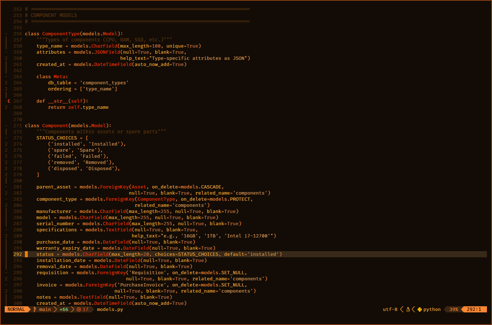

# A Cinnamon-y, fall-inspired color scheme for Neovim, derived from shoenot/witchesbrew.nvim
***Best served in a cauldron with added spices.***



Built with [Lush](https://github.com/rktjmp/lush.nvim/tree/main).

Also includes a kitty theme in extras/kitty.

Plugins supported:
- [Lualine](https://github.com/nvim-lualine/lualine.nvim)

## Installation

With [Lazy](https://github.com/folke/lazy.nvim):
```lua
{
    "shoenot/cinnamonwine.nvim",
    priority = 1000,
    config = function()
        vim.cmd([[colorscheme cinnamonwine]])
    end,
}
```

Also make sure to change your lualine theme to 'cinnamonwine'. 

## Build or Modify

1. Ensure [lush.nvim](https://github.com/rktjmp/lush.nvim) and [shipwright.nvim](https://github.com/rktjmp/shipwright.nvim) are installed
2. Modify [lua/cinnamonwine/theme.lua](lua/cinnamonwine/theme.lua)
3. Rebuild the colorscheme using `./build.sh`

Also check out the helix variant, at shoenot/cinnamonwine.hx if you want. 
